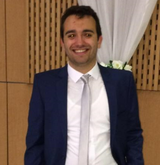

---
---

<link rel="stylesheet" href="styles.css" type="text/css">

Khayat Mohamed Rayen élève ingénieur en 5 année en statistique et analyse de l'information à l'Ecole Supérieure de la Statistique et de l'Analyse de l'Information ESSAI. 

Ce site est réalisé dans le but de présenter mes projets  réalisés durant mon cursus universitaire à l'ESSAI 
et de partager mon CV et mon expérience 